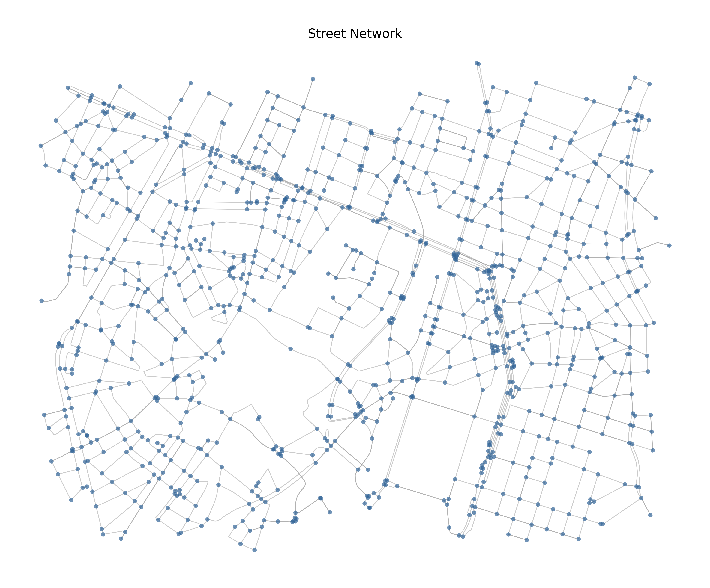

# OpenStreetMap Data Loader

The OpenStreetMap Data Loader is a crucial component that generates the road network graph required by the A* algorithm (described in [Astar.md](Astar.md)). It transforms raw OpenStreetMap (OSM) data into a structured graph format where intersections become nodes and roads become edges.

## Core Purpose

The OSM loader serves three main functions:

1. Downloads and caches road network data from OpenStreetMap using bounding box coordinates
2. Processes raw data into a format suitable for A* path finding
3. Provides visualization tools for road networks and routes

## Data Format Specification

The loader uses OSMnx to transform OpenStreetMap data into a NetworkX graph optimized for A\* path finding:

### 1. Graph Structure

- **Format**: NetworkX MultiDiGraph via `ox.graph_from_bbox()`
- **Network Types**:
  - drive: Drivable public streets (currently the only supported type)
- **Properties**:
  - Bidirectional streets: Two reciprocal directed edges
  - One-way streets: Single directed edge
  - Non-planar: Correctly models bridges, tunnels, and interchanges
  - Simplified topology: Optional via simplify parameter
  - Connected components: Retains only the largest strongly connected component
  - Projected coordinates: UTM for accurate distance calculations

### 2. Node Properties

- **Core Fields** (automatically provided by OSMnx):
  - osmid: OpenStreetMap node identifier (unique)
  - x, y: Longitude, latitude coordinates (automatically projected to UTM)
  - is_intersection: Boolean indicating true intersection vs geometry point

### 3. Edge Properties

- **Core Fields** (automatically provided by OSMnx):
  - length: Distance in meters (UTM projected)
  - travel_time: Estimated duration in seconds (calculated from speed limits)
  - oneway: Boolean indicating directional flow

### 4. Graph Processing

- **Topology Simplification**:
  - Consolidation of complex intersections
  - Removal of non-intersection nodes
  - Preservation of true edge geometry
  - Strong connectivity enforcement

- **Distance Processing**:
  - UTM projection for accurate measurements
  - Travel time calculations based on road types
  - Edge weight computation for A* cost function

## Input Requirements

1. **Bounding Box Specification**:
   - Format: Tuple (left, bottom, right, top) representing geographic coordinates in degrees
   - Coordinates must be in unprojected latitude-longitude (EPSG:4326)

2. **Network Settings**:
   - network_type: Currently only 'drive' is supported
   - simplify: Boolean to enable/disable topology simplification
   - Cache settings: Automatic with configurable timeout (default 180s)

## Network Processing

### 1. Data Download and Validation

- **Input Validation**:
  - Coordinate range checking
  - Bounding box dimension validation
  - Network type verification

- **Data Retrieval**:
  - Efficient queries to OpenStreetMap Overpass API
  - Automatic error handling and retries
  - Smart caching with configurable timeout

### 2. Graph Generation

- **Network Creation**:
  - Direct conversion from bbox coordinates to NetworkX graph
  - Automatic topology simplification when enabled
  - Strong connectivity enforcement
  - UTM projection for accurate measurements

- **Attribute Processing**:
  - Edge speeds calculation
  - Travel time estimation
  - Distance measurements in meters
  - Directional flow handling

### 3. Network Optimization

- **Graph Enhancement**:
  - Extraction of largest strongly connected component
  - Edge speed and travel time calculations
  - UTM coordinate projection for distance accuracy
  - Topology simplification (optional)

## Output Format

The loader produces a structured network graph with:

1. **Node Attributes**:
   - osmid: Unique OpenStreetMap node identifier
   - x, y: Projected UTM coordinates
   - Latitude, longitude: Original geographic coordinates

2. **Edge Attributes**:
   - length: Physical distance in meters
   - travel_time: Estimated duration in seconds
   - speed: Calculated edge speed
   - geometry: Road shape information

## Visualization Capabilities

The loader includes comprehensive visualization features:

1. **Road Network Display**:
   - Color-coded road classifications
   - Interactive navigation
   - Multiple zoom levels
   - Layer management

   
   *Example: Street network visualization of Brussels showing major landmarks*

   The visualization above demonstrates:
   - Blue nodes representing intersections
   - Gray edges representing street segments
   - Clear topology of the road network
   - Simplified network structure

2. **Additional Features**:
   - Points of interest marking
   - Distance measurements
   - Area overview
   - Interactive controls

## Integration with A*

The loader is designed to work seamlessly with the A* path finding algorithm:

1. **Data Preparation**:
   - Graph structure optimization
   - Weight calculations
   - Heuristic function support

2. **Path finding Support**:
   - Direct graph format compatibility
   - Efficient node access
   - Integrated distance calculations

## Performance Considerations

1. **Memory Usage**:
   - Scales with bounding box size
   - Optimized for city-scale areas
   - Automatic cleanup of unused data

2. **Processing Time**:
   - Initial download: Variable based on area size
   - Graph processing: Typically 5-15 seconds
   - Cache retrieval: Near-instant when available

3. **Error Handling**:
   - Robust coordinate validation
   - Network connectivity verification
   - Automatic retry on temporary failures

## Best Practices

1. **Area Selection**:
   - Use appropriate margins around points of interest
   - Consider memory constraints for large areas
   - Ensure reasonable bounding box dimensions

2. **Performance Optimization**:
   - Enable simplification for large areas
   - Use caching for repeated queries
   - Monitor processing times and memory usage

3. **Error Prevention**:
   - Validate input coordinates
   - Check network connectivity
   - Handle edge cases (empty areas, invalid coordinates)

4. **Integration Tips**:
   - Use the provided bbox calculation function
   - Monitor graph size and complexity
   - Consider edge cases in routing algorithms
